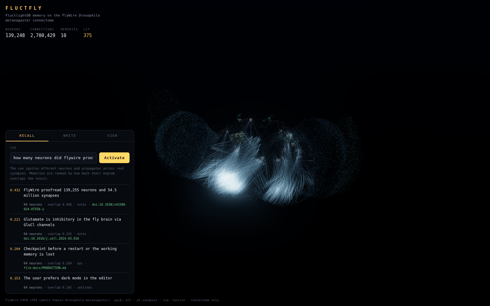
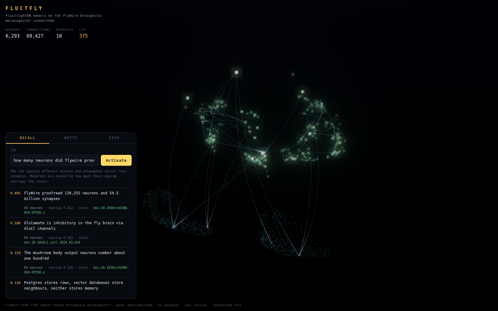

# Fluctfly

**[FluctlightDB](https://github.com/voxmastery/FluctlightDB) agent memory, indexed by the wiring
diagram of a real fly brain.**

FluctlightDB's claim is that a database for agents should have memory operations as its native
verbs — `experience()` to write, `activate()` to recall from a cue, `checkpoint()` to survive a
restart — and that recall should fuse lexical, semantic and *graph* evidence instead of returning
nearest neighbours.

Fluctfly keeps that contract and replaces the graph with the connectome of an adult female
*Drosophila melanogaster*, reconstructed from electron microscopy by
[FlyWire](https://flywire.ai): 139,248 proofread neurons and 2.7 million synaptic connections, in
real anatomical coordinates. Writing a memory ignites a cue on the brain's afferent neurons, lets
it propagate across measured chemical synapses, and stores the sparse set of neurons that fired.
Recalling runs the same propagation and ranks memories by how much their engram overlaps it.

The viewer shows that happening — hop by hop, along the actual synapses that carried it.



## Run it

The repository ships a small pack of the mushroom body, so there is nothing to download:

```bash
git clone https://github.com/voxmastery/Fluctfly && cd Fluctfly
pip install -e .
make run           # http://127.0.0.1:8799
```

Type a cue, press **Activate**, and watch it propagate. Click any neuron for its FlyWire cell type,
transmitter and root id, with a link straight into the FlyWire Codex.

Without the browser:

```bash
fluctfly recall "how many neurons did flywire proofread" --seed
```

## The idea

The fly already solves this problem, and the solution is a hash.

Its mushroom body takes olfactory input from ~50 antennal-lobe channels and expands it onto ~5,200
Kenyon cells through sparse, effectively random connectivity, then silences all but the few percent
that respond most strongly. The resulting sparse tag is a locality-sensitive hash: similar odours
stay similar after the expansion, different ones separate. Dasgupta, Stevens and Navlakha identified
this as a general-purpose similarity-search algorithm
([*Science* 358, 793–796, 2017](https://doi.org/10.1126/science.aam9868)), and it is normally
implemented with a random projection matrix.

Fluctfly runs it on the measured connectivity instead:

```
cue text  ─►  afferent neurons  ─►  spreading across real synapses  ─►  sparse engram
                (ALPNs)              signed by real transmitters        (top-k neurons)
```

1. **Encode.** The cue is sprayed across the brain's afferent population — hashed word and
   character n-grams by default, or a projected sentence embedding with `--embed`.
2. **Spread.** Activation propagates over the CSR adjacency. Each connection is weighted by its real
   synapse count, normalised by the postsynaptic neuron's total input, and signed by the
   presynaptic neuron's predicted transmitter.
3. **Sparsify.** After each hop a global threshold proportional to the strongest response silences
   the rest — the job the APL neuron does for Kenyon cells.
4. **Tag.** The most-activated neurons and their levels *are* the memory's engram.
5. **Rank.** Recall scores stored engrams by cosine similarity against the probe, then applies
   FluctlightDB's provenance rule.

Transmitter signs follow the convention used by published leaky-integrate-and-fire models of this
connectome: acetylcholine excites, GABA inhibits, and **glutamate inhibits**, because the dominant
postsynaptic receptor in the *Drosophila* central brain is the glutamate-gated chloride channel
GluCl. Aminergic transmitters are modulatory and carry a small positive weight.

## Fusing with FluctlightDB

Point Fluctfly at a FluctlightDB brain and every write is mirrored into it, with its recall score
blended into the ranking:

```bash
pip install "fluctlightdb[native]"
fluctfly serve --fluctlight ~/brains/my-agent
```

The connectome contributes graph evidence, FluctlightDB contributes its lexical and semantic
evidence, and provenance breaks the tie — verified file and tool output outranks the same claim made
in chat. Without the package installed, Fluctfly runs connectome-only; the bridge is optional and
never blocks a write.

```python
from fluctfly import BrainPack, Fluctfly

fly = Fluctfly(BrainPack.load("data/packs/mushroom_body"))
fly.experience("Release target is the crates.io registry",
               context="release", verified=True, provenance="file:Cargo.toml")

hits, activation = fly.activate("where do we publish")
print(hits[0].memory.text, hits[0].connectome)
fly.checkpoint("data/store")
```

## Brain packs

A *pack* is the connectome in a form both NumPy and a GPU attribute can read directly: flat
little-endian arrays plus a manifest. Build the larger ones from the public release — the sources
are fetched from GitHub and Zenodo, never redistributed here.

| Pack | Neurons | Connections | Size | Build |
|---|---:|---:|---:|---|
| `mushroom_body` | 6,293 | 69,427 | 0.9 MB | shipped |
| `core` (no optic lobes) | 61,707 | 1,275,188 | 15 MB | `make pack-core` |
| `all` (whole brain) | 139,248 | 2,700,429 | 31 MB | `make pack-all` |

```bash
make fetch      # ~880 MB of FlyWire v783 sources, once
make pack-all
fluctfly serve --pack data/packs/all
```

Connections are thresholded at five synapses, as in the FlyWire papers — single-synapse connections
in an EM reconstruction are dominated by false positives. The whole-brain pack's 2,700,429 edges
match the published count.



## The viewer

One draw call for the whole brain, in true FAFB coordinates. Neurons are point sprites whose size
follows out-degree and whose brightness is driven by a per-vertex activation attribute; arcs are
rebuilt per recall from the CSR adjacency, so every thread on screen is a measured synapse rather
than a line drawn between two lit points. Excitatory connections are blue, inhibitory red.

Three.js is vendored into `web/vendor/`, so the viewer runs with no network and no build step.

Colour by cell class, neurotransmitter, hemisphere or anterior–posterior depth; the **View** tab
also controls glow, neuron size, auto-rotation and whether arcs are drawn.

## What this is, and what it is not

It **is** a working memory store whose index is a real connectome, an implementation of the fly's own
similarity-search algorithm on measured rather than random connectivity, and an instrument for
seeing recall move through anatomy.

It is **not** a simulation of a fly. The dynamics are a signed, sparsified diffusion — not spikes,
compartments or receptor kinetics — and no claim is made that a fly brain stores an agent's
memories. Assigning a sentence to a set of neurons is a mapping this project defines, not a fact
about the animal. Recall quality is bounded by whatever representation reaches the afferents: the
default hash matches surface form, so paraphrase recall needs `--embed`.

## Data and citations

FlyWire data is released under **CC BY 4.0**. If you use this, cite the people who produced it:

- Dorkenwald et al. *Neuronal wiring diagram of an adult brain.* **Nature** 634, 124–138 (2024).
  [doi:10.1038/s41586-024-07558-y](https://doi.org/10.1038/s41586-024-07558-y)
- Schlegel et al. *Whole-brain annotation and multi-connectome cell typing of Drosophila.*
  **Nature** 634, 139–152 (2024). [doi:10.1038/s41586-024-07686-5](https://doi.org/10.1038/s41586-024-07686-5)
- Eckstein, Bates et al. *Neurotransmitter classification from electron microscopy.* **Cell** 187,
  2574–2594 (2024). [doi:10.1016/j.cell.2024.03.016](https://doi.org/10.1016/j.cell.2024.03.016)
- Buhmann et al. *Automatic detection of synaptic partners in a whole-brain Drosophila EM dataset.*
  **Nature Methods** 18, 771–774 (2021). [doi:10.1038/s41592-021-01183-7](https://doi.org/10.1038/s41592-021-01183-7)
- Dasgupta, Stevens & Navlakha. *A neural algorithm for a fundamental computing problem.*
  **Science** 358, 793–796 (2017). [doi:10.1126/science.aam9868](https://doi.org/10.1126/science.aam9868)

Connectivity tables: [Zenodo 10676866](https://doi.org/10.5281/zenodo.10676866).
Annotations: [flyconnectome/flywire_annotations](https://github.com/flyconnectome/flywire_annotations).
Explore any neuron at [codex.flywire.ai](https://codex.flywire.ai).

## Development

```bash
make test      # 34 tests, no download required
make vendor    # re-pin three.js
```

Fluctfly's own code is MIT licensed. FlyWire data keeps its CC BY 4.0 terms.
